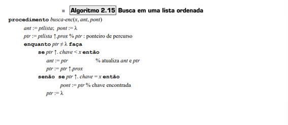
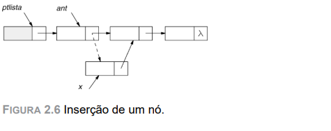
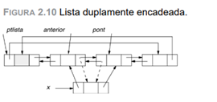
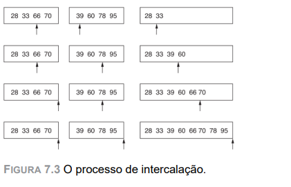

### 1. O que significa alocação estática de memória para um conjunto de elementos? 
É a disponibilização de um tamanho fixo de memoria para execução de um processo na execução de uma logica “Como a implementação da alocação sequencial em linguagens de alto nível é geralmente realizada com a reserva prévia de memória para cada estrutura utilizada, a inserção e a remoção de nós não ocorrem de fato. Em vez disso utiliza-se algum tipo de simulação para essas operações (por exemplo, variáveis indicando os limites da memória realmente utilizada). Por essa razão, pode-se considerar tal alocação como uma alocação estática.”
`JAYME LUIZ SZWARCFITER; MARKENZON, L. Estruturas de dados e seus algoritmos. Rio De Janeiro: Ltc, 2010.`

### 2. Qual a diferença entre alocação estática e alocação dinâmica?
“De maneira geral pode-se afirmar que a alocação encadeada, a despeito de um gasto de memória maior em virtude da necessidade de um novo campo no nó (o campo do ponteiro), é mais conveniente quando o problema inclui o tratamento de mais de uma lista”
`JAYME LUIZ SZWARCFITER; MARKENZON, L. Estruturas de dados e seus algoritmos. Rio De Janeiro: Ltc, 2010.`

### 3. O que é um ponteiro?
“A referência a registros pode ser também realizada por meio de ponteiros, que armazenam endereços, com o uso do símbolo ↑. Cada ponteiro é associado a um único tipo de registro”
`JAYME LUIZ SZWARCFITER; MARKENZON, L. Estruturas de dados e seus algoritmos. Rio De Janeiro: Ltc, 2010.`

### 4. O que é uma estrutura de dados homogêneos?
Variáveis de mesmo tipo de dado, que ainda podem ser classificados como: 
•	dados homogêneos unidimensionais – vetores 
•	dados homogêneos multidimensionais – matrizes;
`Estrutura de Dados de Patricia Rucker de Bassi (Curitiba: Fael, 2017).`

### 5. O que é uma estrutura de dados heterogêneos?
Variáveis de diferentes tipos de dados, que possui a estrutura chamada Registros (ponteiros) que é considerada como tipos de dados heterogêneos.
`Estrutura de Dados de Patricia Rucker de Bassi (Curitiba: Fael, 2017).`

### 6. Qual a vantagem das listas sobre os vetores em termos de consumo de memória? Exemplifique.
Nas listas, o consumo de memória pode crescer e diminuir durante a execução do programa esse consumo é de acordo como a lista vai recebendo valores, alocando memória somente quando necessário, isso trás economia de memória dedicada ao programa. Para um vetor, é reservar um conjunto contíguo de posições de memória independente se será usado ou não
Exemplo Vetor: se for declarado um vetor: int v[1000]; o programa reserva espaço para 1000 inteiros, mesmo que use só 10.
Exemplo Lista:
> [10 | *(ponteiro apontando para o próximo) ] → [20 | *(ponteiro apontando para o próximo) ] → [30 | NULL] -> o que consome é o ponteiro

### 7. O que é uma lista simplesmente encadeada? Apresente um diagrama para ilustrar essa estrutura de dados.
“Qualquer estrutura, inclusive listas, que seja armazenada em alocação encadeada requer o uso de um ponteiro que indique o endereço de seu primeiro nó. O percurso de uma lista é feito então a partir desse ponteiro. A ideia consiste em seguir consecutivamente pelos endereços existentes no campo que indica o próximo nó, da mesma forma que na alocação sequencial se acrescentava uma unidade ao índice do percurso.”

.

.

`JAYME LUIZ SZWARCFITER; MARKENZON, L. Estruturas de dados e seus algoritmos. Rio De Janeiro: Ltc, 2010.`

### 8. O que é uma lista duplamente encadeada? Apresente um diagrama para ilustrar essa estrutura de dados.
Na lista simplesmente encadeada é possível fazer referência ao espaço de memória do próximo nó, na duplamente, por poder haver cenários onde seja necessário a precursão da lista nos dois sentidos indiferentemente, se incorpora um novo campo de ponteiro, que tomam os nomes de ant (apontando para o nó anterior) e post (apontando para o nó seguinte)

.

`JAYME LUIZ SZWARCFITER; MARKENZON, L. Estruturas de dados e seus algoritmos. Rio De Janeiro: Ltc, 2010.`

### 9. O que é uma lista duplamente encadeada? Apresente um diagrama para ilustrar essa estrutura de dados.

### 10. Explique o funcionamento do algoritmo de busca binária e sequencial.
- Busca Binaria: Compara-se o item ao item posicionado no meio do vetor. Se forem iguais, a busca terminou com sucesso. Se o elemento do meio for maior que o elemento sendo procurado, o processo de busca será repetido na primeira metade do vetor (porque esse item deve estar na primeira metade); caso contrário, o processo será repetido na segunda metade. Toda vez que uma comparação é feita, o número de elementos a pesquisar é cortado pela metade. `(TENENBAUM, A. M.; LANGSAM, Y.; AUGENSTEIN, M. J. Estruturas de dados usando C. [s.l: s.n.].)`
- Busca Sequencial: O algoritmo examina uma chave por vez; ao encontrar uma que coincida com o argumento de busca, seu índice (que atua como ponteiro para seu registro) é retornado. Se nenhuma coincidência for encontrada, será retornado -1. `(TENENBAUM, A. M.; LANGSAM, Y.; AUGENSTEIN, M. J. Estruturas de dados usando C. [s.l: s.n.].)`
### 11. Explique o funcionamento dos seguintes algoritmos de ordenação: Insertion sort, Selection sort, Merge sort, Count sort, Quicksort
- Insertion Sort: ‘A ordenação da tabela pode ser estendida até o (i + 1)-ésimo elemento por meio de comparações sucessivas deste com os elementos anteriores, isto é, com o i-ésimo elemento, com o (i – 1)-ésimo elemento etc., procurando sua posição correta na parte da tabela que já está ordenada.”, ou seja, a lista estabelece a primeira posição como lista já ordenada e organiza as próximas de acordo com os último, até se encaixar
`JAYME LUIZ SZWARCFITER; MARKENZON, L. Estruturas de dados e seus algoritmos. Rio De Janeiro: Ltc, 2010.`

- Merge Soft: Primeiramente, o processo de intercalação será revisto. Sejam duas listas A e B, ordenadas, com respectivamente n e m elementos. As duas listas são percorridas por ponteiros ptA e ptB, armazenando o resultado da intercalação na lista C, apontada pelo ponteiro ptC. O primeiro elemento de A é comparado com o primeiro elemento de B; o menor valor é colocado em C. O ponteiro da lista onde se encontra o menor valor é incrementado, assim como o ponteiro da lista resultado; o processo se repete até que uma das listas seja esgotada. Neste ponto, os elementos restantes da outra lista são copiados na lista resultado. A Figura 7.3 ilustra o processo.
  
.

`JAYME LUIZ SZWARCFITER; MARKENZON, L. Estruturas de dados e seus algoritmos. Rio De Janeiro: Ltc, 2010.`

- Quick Sort: Dada uma tabela L com n elementos, o procedimento recursivo para ordenar L consiste nos seguintes passos:
  - se n = 0 ou n = 1 então a tabela está ordenada;
  - escolha qualquer elemento x em L – este elemento é chamado pivô; 
  - separe L – {x} em dois conjuntos de elementos disjuntos: S1 = {w ∈ L – {x}|w < x} e S2 = {w ∈ L – {x}|w ≥ x}; 
  - o procedimento de ordenação é chamado recursivamente para S1 e S2 ;
  - L recebe a concatenação de S1 , seguido de x, seguido de S.
`JAYME LUIZ SZWARCFITER; MARKENZON, L. Estruturas de dados e seus algoritmos. Rio De Janeiro: Ltc, 2010.`

- Selection Sort: faz a ordenação ao passar sempre o menor valor do vetor para a primeira posição (ou o maior dependendo da ordem requerida), depois o de segundo menor valor para a segunda posição, e assim é feito sucessivamente com os n-1 elementos restantes, até os últimos dois elementos. (https://pt.wikipedia.org/wiki/Selection_sort)
- Count Sort: A ordenação por contagem determina, para cada elemento de entrada x, o número de elementos menores que x e usa essa informação para inserir o elemento x diretamente em sua posição no arranjo de saída. Por exemplo, se 17 elementos forem menores que x, então x pertence à posição de saída 18. Temos de modificar ligeiramente esse esquema para lidar com a situação na qual vários elementos têm o mesmo valor, já que não queremos inserir todos eles na mesma posição. 
`(Cormen, Thomas (2001). Introduction to Algorithms. London, England: MIT Press & McGraw-Hill. 168 páginas)`
